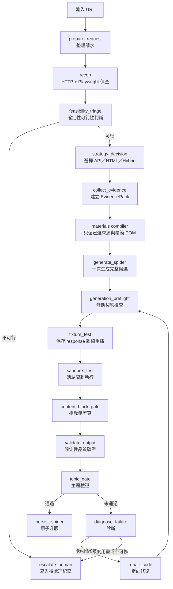

# Spider Forge

輸入網站 URL，自動偵查資料來源、生成 Scrapy 爬蟲、隔離執行、驗證品質，失敗時最多
進行兩輪定向修復。通過所有檢查的爬蟲才會升版；失敗結果寫入待人工處理紀錄。

流程會先以不呼叫模型的方式檢查可重播端點、文章資料與公開存取狀態。明確不可行時
直接停止；可行時由確定性材料編譯器只保留已選來源、精簡 DOM 與必要契約，再交給
產碼模型，避免模型猜測端點、參數或被無關材料塞滿上下文。

## 模組邊界

- `pipeline.py` 是唯一流程組裝入口，負責節點順序與分支。
- `stages/` 只放流程節點；節點不得互相 import。
- `shared/` 放多個節點共同使用的解析、提示、品質規則及領域服務。
- `crawler/news_crawler/fixture_runner.py` 只執行 JSON fixture 契約，
  不依賴控制層；控制層也不 import crawler runtime。
- `clients/` 封裝瀏覽器與模型服務。
- `output/` 管理候選、正式版本、歷史版本及人工回滾。
- `runs/` 管理追加式執行紀錄。
- `config.py` 是設定與執行期路徑的唯一來源。
- Spider Forge 不 import `crawler` 或 `news_crawler`。

候選爬蟲是自包含單一檔案，會在檔內定義 `ArticleItem`。本機沙盒直接以
`scrapy runspider` 執行；Docker 模式則把程式經標準輸入送進獨立、唯讀且無機密資料的
crawler 容器。

robots 不參與 Spider Forge 的可行性判斷、產碼契約或拒絕路由。付費牆、CAPTCHA 與
登入牆仍是不繞過的硬界線。

## 流程



不可修復的失敗類別不會跑滿兩輪修復。一般產碼與第一輪修復預設使用 DeepSeek，第二輪
才升級至 Kimi；可用環境變數 `SPIDERFORGE_GENERATION_PROVIDER`、
`SPIDERFORGE_REPAIR_PROVIDER`、`SPIDERFORGE_FINAL_REPAIR_PROVIDER` 覆寫。

產碼維持單次完整輸出，不採兩次生成後組裝。材料過量先由可重現的程式規則處理：
移除 script/style/svg 等雜訊、裁切 DOM、限制樣本數、排除未選 feed。若跨站測試仍
證明確定性規則無法辨識正文邊界，才考慮把地端模型或 Gemini 加成選用的語意裁切後備；
它不應成為正常流程的新必要依賴。

## 證據與執行指標

`EvidencePack.replay_exchange` 明確保存下列已遮密資料：

- 請求：method、URL、必要 headers、body。
- 回應：狀態碼、必要 headers、body 樣本、是否截斷。

批次執行會把每次 EvidencePack 寫入 `runs/<run_id>/evidence.json`，並在
`records/runs.jsonl` 記錄：

- `first_pass_success`：第一次沙盒是否直接通過。
- `repair_count`：實際進入修復的輪數。
- `coder_tokens`：產碼與修碼的 token 總量。

可從 `repo 根目錄` 執行以下指令查看目前指標：

```console
uv run python -m spider_forge.runs.ledger
```

`first_pass_rate` 的分母是各來源最後一次執行的總站數，不只計算最後成功的站，避免把
失敗站排除後高估首次成功率。離線驗收只能證明指標與流程正確；真實站點的改善幅度仍須
用同一批站點在改造前後各跑一次才能成立。

## 目錄

```text
spider_forge/
├── __main__.py               # python -m spider_forge
├── cli.py                    # 所有命令列子命令
├── pipeline.py
├── config.py
├── state.py
├── site_queue.yaml
├── stages/
│   ├── probe.py
│   ├── triage.py
│   ├── evidence.py
│   ├── generate.py
│   ├── fixture.py
│   ├── sandbox.py
│   ├── validate.py
│   └── repair.py
├── shared/
│   ├── evidence.py
│   ├── fixture.py
│   ├── generation.py
│   ├── materials.py
│   ├── parsers.py
│   ├── prompts.py
│   ├── quality_rules.py
│   ├── request_identity.py
│   ├── summaries.py
│   └── topic.py
├── clients/
│   ├── browser.py
│   ├── coder.py
│   ├── judge.py
│   ├── page.py
│   └── topic.py
├── output/
│   ├── artifacts.py
│   └── manager.py
├── runs/
│   ├── batch.py
│   └── ledger.py
├── tools/
│   └── topic_training.py
└── tests/
```

執行期資料不放在原始碼目錄。預設位於套件內已忽略的 `runtime/`；正式環境可用
`SPIDERFORGE_DATA_DIR` 指向 `/runtime/spider_forge`：

```text
runtime/spider_forge/
├── requests/
├── runs/<run_id>/
├── artifacts/
│   ├── candidates/
│   ├── active/
│   └── versions/
├── records/
│   ├── runs.jsonl
│   ├── promotions.jsonl
│   └── dead_letter/
└── models/
```

## 本機安裝與測試

先進入 `repo 根目錄`。專案的 `/.venv` 由 UV 管理，因此 UV 只負責
安裝與檢查相依套件，程式、編譯與測試都直接交給該環境的 Python；不需要啟用環境，
也不依賴專案自訂 PowerShell 腳本：

```console
uv pip install --python uv run python -r spider_forge/requirements-test.txt

uv pip check --python uv run python
uv run python -m compileall -q spider_forge crawler/news_crawler
uv run python -m pytest -q spider_forge/tests crawler/tests
```

上面三個檢查就是本機 CI 的標準順序：先驗證相依套件，再編譯全部模組，最後跑完整
回歸測試。測試不會執行真實網站 pipeline，也不應呼叫外部模型或消耗 API 額度。

若終端機的 `python -c "import sys; print(sys.executable)"` 已顯示
`/.venv/Scripts/python.exe`，後續可把 `uv run python`
簡寫成 `python`。

套件分工：

- `requirements.txt`：正式控制面與本機沙盒。
- `requirements-test.txt`：在正式依賴上只增加 pytest。
- `requirements-training.txt`：只有訓練或使用離線主題模型時才安裝的重型套件。

Ollama 不需要 Python SDK。`clients/judge.py` 透過 HTTP 呼叫本機 Ollama；產碼與修碼
則由 `clients/coder.py` 透過 HTTP 呼叫 DeepSeek／Kimi。若主題設定啟用 Ollama 建議
功能，`shared/topic.py` 也會直接呼叫其 HTTP API。

## 執行

真實 pipeline 會存取網站並呼叫模型，可能消耗外部 API 額度。請先在 `.env`
或作業系統環境變數設定：

- `DEEPSEEK_API`：初次產碼與一般修復所需。
- `KIMI_API`：只有流程真的進入最後一輪 Kimi 修復時才需要。
- `LLM_API_KEY`：預設 Gemini 主題閘門所需。
- `OLLAMA_HOST`：選用；預設為 `http://localhost:11434`。
- `SPIDERFORGE_JUDGE_MODEL`：選用；預設為 `qwen2.5:7b-instruct`。

單一網址：

```console
uv run python -m spider_forge run --url "https://example.com/news"
```

只允許初次生成、不進模型修復：

```console
uv run python -m spider_forge run --url "https://example.com/news" --max-retries 0
```

執行 `site_queue.yaml` 全部來源，或只跑指定來源：

```console
uv run python -m spider_forge batch
uv run python -m spider_forge batch cnyes cna
```

查看執行紀錄與資料位置：

```console
uv run python -m spider_forge status
uv run python -m spider_forge paths
```

若要像人工驗收一樣逐關查看輸出，可用已驗證的 RBA 請求範例。每個指令只執行一關；
先讀完輸出的 JSON，再決定是否執行下一行：

```console
uv run python -m spider_forge.tests.manual.run_one_stage prepare --input spider_forge/tests/manual/rba_request.json --output spider_forge/runtime/manual/rba/01_prepare.json
uv run python -m spider_forge.tests.manual.run_one_stage recon --input spider_forge/runtime/manual/rba/01_prepare.json --output spider_forge/runtime/manual/rba/02_recon.json
uv run python -m spider_forge.tests.manual.run_one_stage triage --input spider_forge/runtime/manual/rba/02_recon.json --output spider_forge/runtime/manual/rba/03_triage.json
uv run python -m spider_forge.tests.manual.run_one_stage strategy --input spider_forge/runtime/manual/rba/03_triage.json --output spider_forge/runtime/manual/rba/04_strategy.json
uv run python -m spider_forge.tests.manual.run_one_stage evidence --input spider_forge/runtime/manual/rba/04_strategy.json --output spider_forge/runtime/manual/rba/05_evidence.json
uv run python -m spider_forge.tests.manual.run_one_stage generate --input spider_forge/runtime/manual/rba/05_evidence.json --output spider_forge/runtime/manual/rba/06_generate.json
uv run python -m spider_forge.tests.manual.run_one_stage preflight --input spider_forge/runtime/manual/rba/06_generate.json --output spider_forge/runtime/manual/rba/07_preflight.json
uv run python -m spider_forge.tests.manual.run_one_stage fixture --input spider_forge/runtime/manual/rba/07_preflight.json --output spider_forge/runtime/manual/rba/08_fixture.json
```

`recon`、`evidence` 會接觸真實網站，`strategy` 可能使用 Ollama，`generate` 會使用
DeepSeek；`preflight` 與 `fixture` 是離線檢查。這組逐關工具刻意沒有「一次跑完」模式。

選用的離線主題模型訓練需先安裝 `requirements-training.txt`：

```console
uv sync --extra spider-forge --extra worker
uv run python -m spider_forge train-topic topic_gold.jsonl --output candidate.json
```

（訓練用的 scikit-learn 與 sentence-transformers 在 `worker` extra 裡，正式 pipeline 不需要。）

Docker：

```console
docker compose --profile manual build crawler
docker compose --profile manual build spider-forge
docker compose --profile manual run --rm spider-forge run --url "https://example.com/news"
```

控制容器可以持有模型金鑰與 Docker socket；候選子容器不會取得它們。Docker 模式只以
標準輸入傳入候選程式，以標準輸出回傳 JSON。

## 外部服務

- Playwright：網站與網路請求偵查。
- Ollama：本機策略判斷與診斷，透過 HTTP。
- DeepSeek／Kimi：程式生成與修復。
- Gemini：預設主題判定；服務不可用時拒絕升版。

現行設計與後續工作以本 README 及
[`REFACTOR_PLAN.md`](REFACTOR_PLAN.md) 為準；歷史規格與實驗索引見
[`docs/00_index.md`](../../../../docs/00_index.md)。
